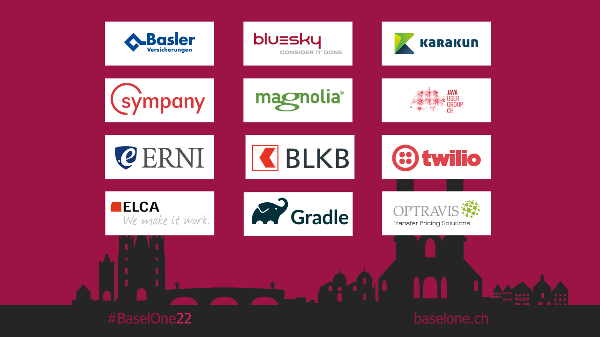

= Pattern Matching: mit Java 19
:backend: revealjs
:revealjs_theme: workshop
:revealjs_controls: true
:revealjs_controlsTutorial: false
:revealjs_progress: true
:revealjs_slideNumber: false
:revealjs_history: true
:revealjs_center: true
:revealjs_transition: fade
:revealjs_backgroundTransition: fade

:imagedir: images

:icons: image
:icontype: svg
:iconsdir: ../../_shared/icons

// Edit host information
:host-name: BaselOne
:host-url: https://www.baselone.ch
:host-logo-style: logo
:host-logo-url: ../../_shared/images/hosts/BaselOne22_Logo.png
:host-twitter-url: https://twitter.com/baselone
:host-twitter-name: @Baselone

include::../../_shared/_hightlightjs.adoc[]
include::../../_shared/events-on-title-and-footer.adoc[]
// ####################################################
// #            Presentation area  start              #
// ####################################################
// Advertisement required by Basel One
[%notitle]
== Advertisement

include::agenda.adoc[]
include::basics.adoc[]
include::linkedListExample.adoc[]
include::closing.adoc[]

// ####################################################
// #            Presentation area  end                #
// ####################################################
include::images/_sources.adoc[]