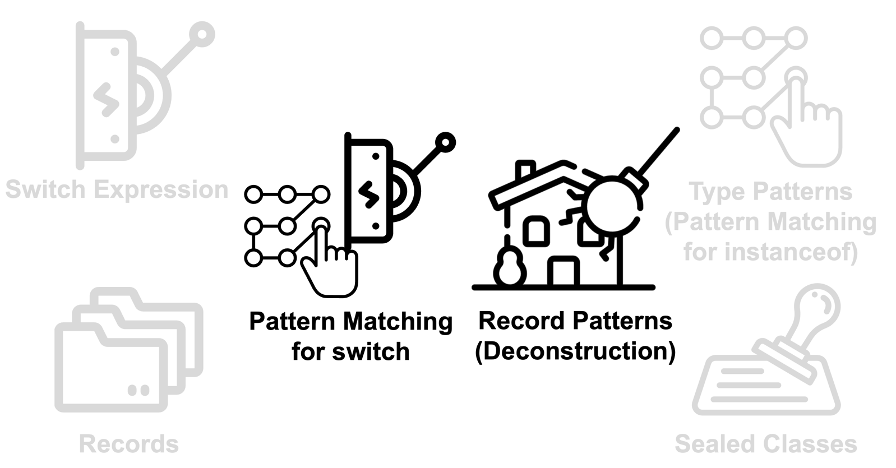
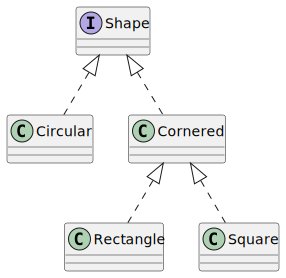

== Basics
=== Einrichtung und Setup
* JDK 19 installieren
** z. B. von https://adoptium.net/
** alternativ über Homebrew, SDKMan, …
* aktuelle IDE (IntelliJ IDEA, Eclipse, Visual Studio Code, …)
** sollte Java 19 Features unterstützen
** IntelliJ 2022.2, Eclipse 2022-09 (4.25)

=== Road to OpenJDK 21 (LTS)
image::images/openjdk_java_19.png[height=650px]

=== Features

=== On the Menu
* JEP 361: Switch Expression
* JEP 359: Record Classes
* JEP 409: Sealed Classes
* JEP 394: Type (instanceof) Pattern
* JEP 427: Pattern Matching for switch
* JEP 405: Record (deconstruction) pattern

=== JEP 361
Switch Expression

[source,java,highlight=1|2|4..7]
----
int j = switch (day) {
  case MONDAY, null -> 0;
  case TUESDAY -> 1;
  default -> {
    int k = day.toString().length();
    yield k;
  }
};
----

=== JEP 359
Record classes

[source,java]
----
record Range(List<Integer> values) {
  Range { Objects.requirenNonNull(values); }

  Range(List<Integer> values) {
    this.values = List.copyOf(values);
  }

  Range(Integer i1, Integer i2) {
    this(List.of(i1,i2));
  }

  int length() { return values.length(); }
}
----

[.notes]
--
*Goals*: Enhance with transparent carriers for immutable data, Step towards pattern matching

*Motivation*: Simple aggregation of values, Focus on modelling immutable data, Auto implement data driven methods (equals, hashcode)

*Gotchas*: Are final, Can only implement sth,, Not only syntactic sugar

compact conical const <1>, Default constructor is conical
--

=== JEP 409
Sealed classes

[source,java]
----
sealed interface Shape permits Circular, Cornered { }

non-sealed class Circular implements Shape {}

sealed class Cornered implements Shape {
    final class Rectangle implements Cornered {}
  record Square(int h) implements Cornered {}
}
----
[.notes]
--
*Goals*: Add heritage control, Add exhaustiveness

*Motivation*: Give control to developers, Add access restrictions, Support pattern matching
--

=== Sealed classes

=== JEP 394
Type (instanceof) Pattern

[source,java]
----
if (o instanceof Triangle t) {
    System.out.println("Area: " + t.calculateArea());
} else if (!(o instanceof String str)) {
    System.out.println("Not Triangle or String ");
} else {
    System.out.println("String value is:" + str);
}
----

=== JEP 427
Pattern matching for Switch

[source,java]
----
switch (s) {
  case Triangle t when t.calculateArea() > 100 ->
    System.out.println("Large");
  case Triangle t -> System.out.println("Small");
  default -> System.out.println("Non-triangle");
}
----

=== JEP 405
Record deconstruction pattern

[source,java]
----
record Point<T>(T x, T y) {}

static <T> void print(Object o) {
  if (o instanceof Point(T x, T y)) {
    System.out.println(x + "+" + y);
  }
}
----