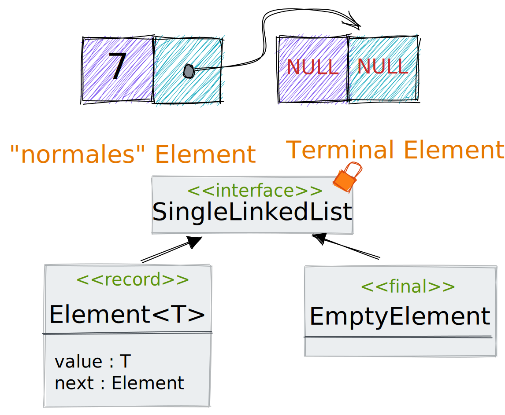
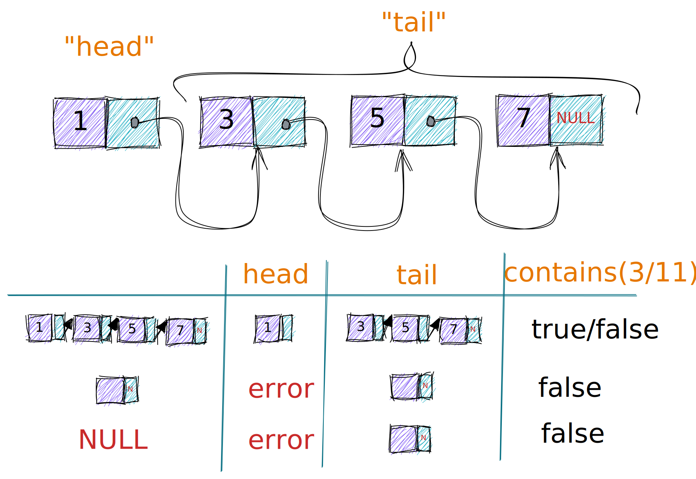

== Example: Single Linked List
=== Basics
image::images/LinkedListBasics.excalidraw.svg[width=850]

=== Structure

=== Operations

=== Solution Code
Solution und Binärbaum https://github.com/MBoegers/TreeExperiments[MBoegers/TreeExperiments]